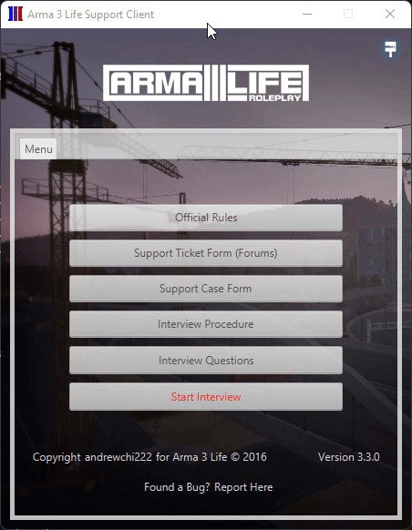

<h2 align="center">
  Arma 3 Life Support Client 
</h2>

  

 

 &nbsp;
 &nbsp;
 &nbsp;
 &nbsp;
 &nbsp;

## Built With

This project was built using these technologies.

- Java
- CSS

## Features

**Custom Backgrounds**

**Hidden Easter Eggs with nostalgic remarks**

**Detailed Interview Form with an age check functionality**

**Verbal Support Request Form**

**Support Ticket Form**

## Introduction

This application was built and designed to support the active player base of the first official Arma 3 Life Roleplay server, Arma 3 Life (rebranded to Life-Studios in 2017). In its prime, this client supported an average of 300 people per day. This client processed over 1.3 million requests and supported over 350,000 people across a 4 year period. The purpose is simple and was created to be a central hub for my support team which consisted of a team of over 1,000 people across 5 countries. This client allowed my team to create properly formatted and useful interview logs, verbal support request logs, and support tickets. Output logs were then manipulated into detailed charts, statistics, and other human-readable information for tracking.

## Usage

This project was private and restricted to use only in Arma 3 Life and other affiliated servers during its lifetime. 3 years later, I have decided to release the source code for public, unrestricted use. 

No support will be given. This project is extremely deprecated at this point. You are to use this at your own risk.

## Giving Credit

You can fork this repo to modify and make changes of your own. Please give me proper credit by linking back to [andrewchi222](https://github.com/andrewchi222/arma3life-support-client). Thanks!
